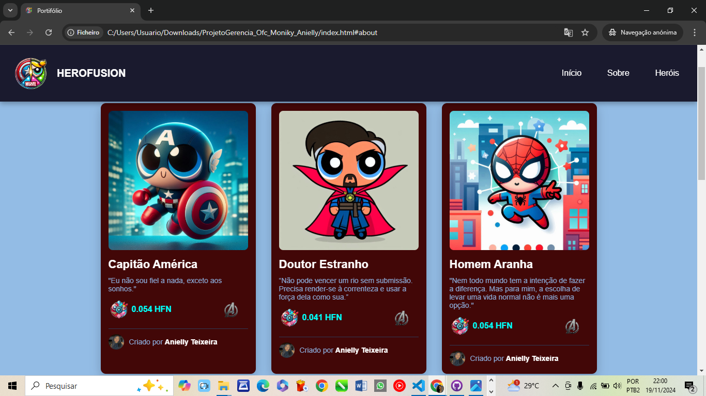
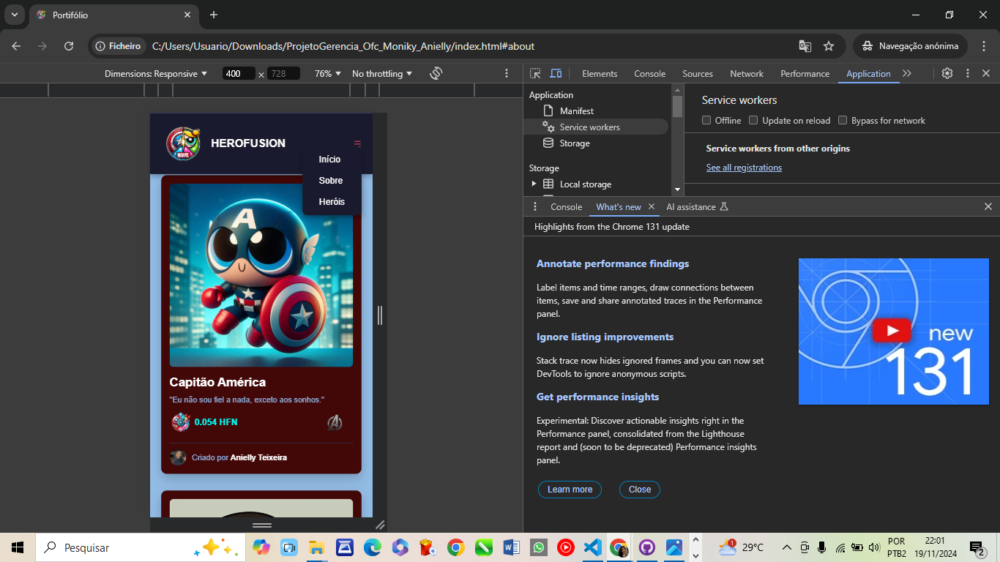
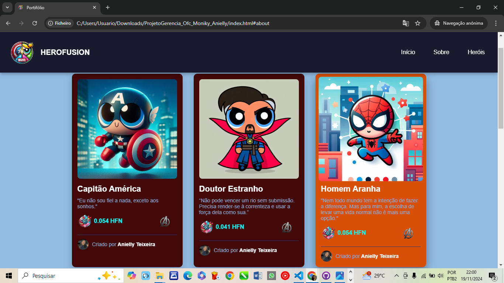

# HeroFusion Portifólio

Um site que combina os universos da **Marvel** e das **Meninas Super Poderosas**, apresentando um portfólio estilizado com cards interativos, um sistema de navegação responsivo e um design moderno inspirado nesses universos icônicos.

---

## Tecnologias Utilizadas

Este projeto foi desenvolvido com as seguintes tecnologias:

- **HTML5**: Estrutura semântica da página.
- **CSS3**: Estilização responsiva e animações.
- **JavaScript**: Interatividade e manipulação do DOM.
- **Design Responsivo**: Layout adaptável para dispositivos móveis e desktops.
- **DALL·E**: Criação de logos e imagens temáticas.

---

## Funcionalidades

- **Navbar Responsivo**: Com menu hamburguer em dispositivos móveis.
- **Cards Interativos**: Incluindo imagens, descrições e animações.
- **Temática Única**: Combinação de elementos dos universos Marvel e Meninas Super Poderosas.
- **Design Moderno**: Interface estilizada e atraente.

---

## Capturas de Tela

### Página Inicial

### Navbar Responsivo

### Cards Interativos

---

## Links

- **Acesse o projeto online**: [HeroFusion Portfolio](https://monikysouzalopes.github.io/ProjetoGerencia_Ofc_Moniky_Anielly/)
- **Repositório GitHub**: [Repositório](https://github.com/MonikySouzaLopes/ProjetoGerencia_Ofc_Moniky_Anielly.git)

---

## Autores

- Criado por Anielly Teixeira dos Santos.

Entre em contato:
- Email: lisagoncalves.1977@gmail.com
- LinkedIn: www.linkedin.com/in/anielly-teixeira-442514333

- Criado por Moniky Souza Lopes.

Entre em contato:
- Email: monikysouzalopes@gmail.com
- LinkedIn: www.linkedin.com/in/moniky-souza-lopes-33a65332b
